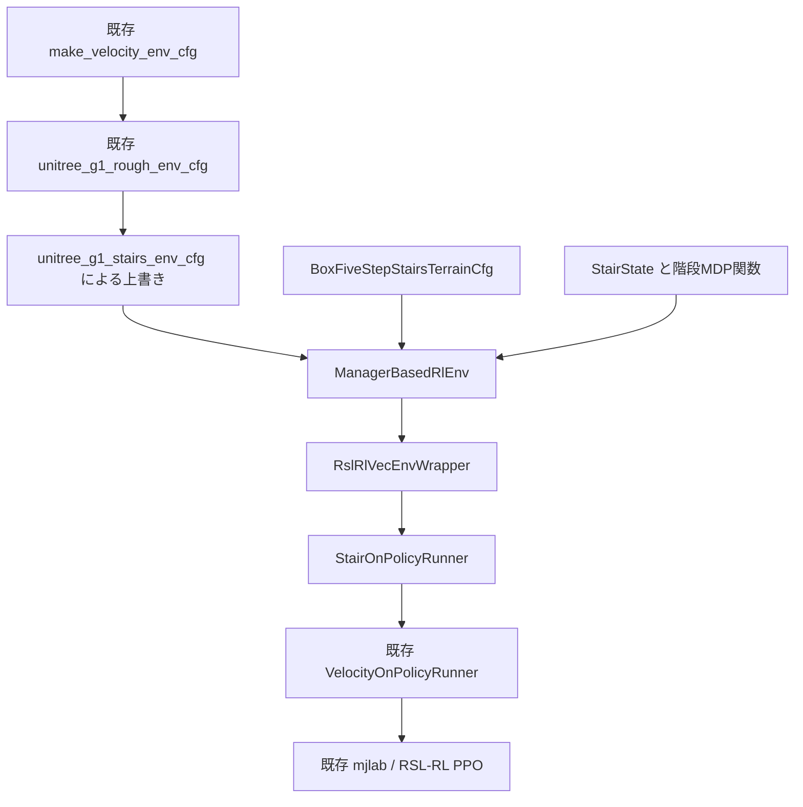

# G1の知覚付き階段上り学習：問題設定と実装設計

本書は `feature/g1-stairs-perceptive-ppo` の階段上りタスクについて、元の `unitree_rl_mjlab` からの変更と、各設計が実際にどの処理へ対応するかを記述する。対象は `Unitree-G1-Stairs` と `Unitree-G1-Stairs-Robust` である。実行手順の概要は [stairs.md](stairs.md) を参照されたい。

記述対象の実装commitは `a2355f12b4bb9c346915273b8bdb577968dd8745`、比較対象の `main` は `1425b15f73bd4095f0df53709d7c389c3eb9e790` である。特記しない数値はコードの既定値であり、CLIで上書きした個別実験の設定ではない。依存ライブラリ内の挙動は、調査環境の mjlab 1.2.0、MuJoCo 3.5.0、mujoco-warp 3.5.0、RSL-RL 5.0.1 を参照した。関数名はライブラリ更新によって挙動が変わり得るため、再現時にはリポジトリと依存関係を併せて固定する。

## 1. 問題設定と設計上の立場

### 1.1 達成対象

目標は、29自由度のUnitree G1を下側の平地から発進させ、蹴上げ高さ0.17 m・踏面奥行0.17 mの直線階段を5段上り、総高さ0.85 mの上側平面へ移行させることである。ロボットは前進速度指令と自身の状態、高さマップに基づいて全身の関節目標角を出力する。成功には上側への移行後に一定の支持・姿勢条件を1秒間維持することを要求する。

学習対象は「下の平地から登り切る」動作であり、上側で速度をゼロにする精密停止は成功要件に含めない。支持足の順序、歩行周期、各段に置く足の位置は指定しない。両足が同時に接地し続けることも要求しない。地形の寸法と接触情報は報酬・終了判定に利用するが、actorへ段番号や成功判定タイマーを直接渡すことはしない。

G1の衝突形状は元実装のまま使用する。片足は7個のcapsuleで構成され、前後方向の衝突形状は約20.6 cmである。この長さは目標踏面の17 cmを上回るため、足裏全体を一つの踏面に収める条件は設けず、有効な部分支持を許容する。足の縮小や、脚・胴体の衝突無効化によって課題を容易化してはいない。

実装対応：足形状は [g1.xml](../src/assets/robots/unitree_g1/xmls/g1.xml#L98)、全身衝突設定は [FULL_COLLISION](../src/assets/robots/unitree_g1/g1_constants.py#L229)、階段の設定入口は [unitree_g1_stairs_env_cfg](../src/tasks/stairs/config/g1/env_cfgs.py#L23)。

### 1.2 強化学習としての定式化

物理シミュレータの状態、速度指令、地形、接触タイマーなどを含む状態を $s_t$、actor観測を $o_t^\pi$、critic観測を $o_t^V$、関節指令を生成する行動を $a_t\in\mathbb{R}^{29}$ とする。学習する方策は

$$
a_t\sim\pi_\theta(a_t\mid o_t^\pi),\qquad
J(\theta)=\mathbb{E}\left[\sum_{t=0}^{T-1}\gamma^t r_t\right]
$$

であり、PPOで最適化する。actorはシミュレータの全状態を観測しないため、actor側からは部分観測問題となる。直近5フレームの固有感覚・行動履歴を利用するが、ネットワーク自体はfeed-forward MLPである。criticには一部の追加状態を与える非対称actor–criticを採用する。ただしcritic観測も全物理状態や全タイマーを網羅したものではない。

平地と異なる寸法の階段に同じ方策を適用し、環境ごとの課題レベルを変えて学習データの分布を調整する。平地用policyから階段用policyへネットワークを作り直す段階分割はない。

## 2. 元実装の再利用範囲と変更点

階段設定は `unitree_g1_rough_env_cfg()` を呼び出して得た既存G1 rough taskの設定を上書きする。元のvelocity taskやG1 assetの実装は変更していない。

| 項目 | 元のG1 rough task | 階段taskでの処理 |
| --- | --- | --- |
| ロボット・衝突・actuator | 29関節G1、位置制御、全身衝突 | 再利用 |
| 物理・制御周期 | 5 ms物理積分、4回のdecimation | 再利用：制御周期20 ms |
| 地形 | rough terrain generator | 寸法を明示した平地＋12種類の5段階段へ置換 |
| 移動指令 | 多方向速度、旋回、停止を含む | 前進0.25～0.4 m/s、横速度0、heading目標0 |
| actor時間情報 | 現在値と0.6秒周期のphase | phaseを削除し、固有感覚・行動に5フレーム履歴 |
| 高さ観測 | pelvis基準、1.6×1.0 m、10 cm間隔 | torso IMU基準、1.6×0.8 m、5 cm間隔 |
| 速度報酬 | body frameの水平・鉛直速度 | yaw基準の水平速度のみ。静止時の値を差し引く |
| 歩容の誘導 | 周期接地、固定の足高さ、全関節姿勢 | 該当項を削除し、進捗・完了と弱い正則化を使用 |
| 終了 | 時間切れ、過大傾斜 | 登頂成功、階段用の物理失敗、時間切れを分離 |
| カリキュラム | 移動距離ベースの地形難度、速度範囲拡張 | 環境ごとの成功／不成功による課題レベル更新 |
| 保存・再開 | actor、critic、optimizerなど | 既存Runnerを継承し、課題レベル・不成功回数も保存 |
| 評価 | 主にplayによる再生 | 固定寸法・seed別の完了episode評価を追加 |

構成と呼び出し関係は次のようになる。



| ファイル | 担当する処理 |
| --- | --- |
| [stairs/config/g1/env_cfgs.py](../src/tasks/stairs/config/g1/env_cfgs.py) | 地形・観測・センサ・報酬・終了・ランダム化の組み立て |
| [stairs/terrains.py](../src/tasks/stairs/terrains.py) | 段階別寸法、box形状、地形原点 |
| [stairs/mdp.py](../src/tasks/stairs/mdp.py) | 接触からの支持判定、共有状態、報酬、終了、カリキュラム、統計 |
| [stairs/runner.py](../src/tasks/stairs/runner.py) | カリキュラム状態の保存・復元 |
| [stairs/config/g1/rl_cfg.py](../src/tasks/stairs/config/g1/rl_cfg.py) | 既存PPO設定の再利用、実験名とloggerの指定 |
| [stairs/config/g1/__init__.py](../src/tasks/stairs/config/g1/__init__.py) | 通常taskとRobust taskの登録 |
| [scripts/evaluate_stairs.py](../scripts/evaluate_stairs.py) | 固定条件の独立評価とJSON保存 |

Python packageの登録は既存の [src/tasks/__init__.py](../src/tasks/__init__.py) による自動importを利用する。学習入口も既存の [scripts/train.py](../scripts/train.py) を使う。

## 3. 座標系、地形、初期状態、速度指令

### 3.1 座標系

世界座標を $w$、pelvis/root座標を $b$、rootのyaw角だけを反映した水平座標を $h$ とする。階段は世界X方向へ上る向きに置く。以下の階段内座標 $p=(x,y,z)$ は、世界座標からそのepisodeの地形原点 $o_e$ を引いた値である。

$$
p=p^w-o_e.
$$

地形原点は、地形patch内の $(1.2,1.5,0)$ mに固定する。これは実際のreset位置そのものではなく、その周りに位置のばらつきを加える基準点である。異なる段階でも原点を下側平地に保つ。

### 3.2 明示的な5段階段

地形patchの大きさは5.5×3.0 m、階段幅は1.2 mである。床はpatch全体の $z\in[-0.1,0]$ を占めるboxとする。初段の蹴上げは原点から $x_0=0.6$ mに置く。

段数 $n=5$、蹴上げ $h$、踏面奥行 $d$ に対し、第 $k$ 段のboxは

$$
x\in[x_0+(k-1)d,\ x_0+kd],\quad
y\in[-0.6,0.6],\quad z\in[0,kh],\quad k=1,\ldots,5
$$

とする。各boxは隣接する境界で接し、階段用box同士を体積的に重ねない。第5踏面の先には同じ高さの踊り場を作り、patchの端まで延長する。

$$
x_{\mathrm{landing}}=x_0+5d,\qquad z_{\mathrm{top}}=5h.
$$

目標寸法では第5踏面の開始が $x=1.28$ m、踊り場の開始が $x=1.45$ m、最上面の高さが0.85 mとなる。「第5踏面の開始」と「踊り場の開始」は区別する。patch端は原点から $x=4.3$ mなので、実際の踊り場長は目標寸法で2.85 m、奥行30 cmの段階では2.2 mである。定数 `LANDING_LENGTH=1.2` は寸法検証に使う最小長であり、生成される踊り場を1.2 mに固定する値ではない。

実装対応：[BoxFiveStepStairsTerrainCfg.function](../src/tasks/stairs/terrains.py#L75)。地形geomはgroup 0に置き、高さ観測から選択できるようにする。

### 3.3 難度段階

| Level | 段数 | 蹴上げ $h$ [cm] | 踏面 $d$ [cm] | 総高さ [cm] |
| --- | ---: | ---: | ---: | ---: |
| 0 | 0 | 0 | 30（判定用の仮想値） | 0 |
| 1 | 5 | 2 | 30 | 10 |
| 2 | 5 | 4 | 30 | 20 |
| 3 | 5 | 6 | 30 | 30 |
| 4 | 5 | 8 | 30 | 40 |
| 5 | 5 | 10 | 30 | 50 |
| 6 | 5 | 12 | 30 | 60 |
| 7 | 5 | 14 | 30 | 70 |
| 8 | 5 | 17 | 30 | 85 |
| 9 | 5 | 17 | 25 | 85 |
| 10 | 5 | 17 | 21 | 85 |
| 11 | 5 | 17 | 19 | 85 |
| 12 | 5 | 17 | 17 | 85 |

まず踏面を広く保ったまま蹴上げを増やし、その後に踏面を狭める。平地以外は最初から5段であり、1段、2段と段数を増やすカリキュラムではない。

通常学習では13行×4列の地形を生成し、行をlevelに対応させる。generatorの連続難度 $u$ は `floor(u * len(stages))` を有効範囲にclipして離散stageへ変換する。このため、行内の難度に乱数が入っても階段寸法は表の値に固定される。地形生成のseedは42である。4列は同じ寸法設定の地形であり、段差形状のランダム化ではない。

固定levelの再生・評価では1行×1列だけを生成し、地形のローカル行番号0とは別に、指定したグローバルlevelを `StairState` へ渡す。

実装対応：[STAIR_STAGES](../src/tasks/stairs/terrains.py#L29)、[terrain generator設定](../src/tasks/stairs/config/g1/env_cfgs.py#L36)。

### 3.4 Reset分布

初期姿勢は既存 `HOME_KEYFRAME` を再利用する。root高さは0.8 m、左右hip pitchは−0.1 rad、kneeは0.3 rad、ankle pitchは−0.2 rad、shoulder pitchは0.35 rad、elbowは0.87 rad、shoulder rollは左+0.18 rad・右−0.18 radである。その他の関節角は既定値0、関節速度とroot速度は0とする。

各episodeのreset時に、rootの位置・向きを次の一様分布から設定する。

$$
x\sim U(-0.2,0.2)\;\mathrm{m},\quad
y\sim U(-0.08,0.08)\;\mathrm{m},\quad
\psi\sim U(-0.08,0.08)\;\mathrm{rad}.
$$

従って初段までの前後距離は0.4～0.8 mになる。関節角・関節速度へのreset時の追加ばらつきは0である。速度指令に合わせて初速度を与える処理も `init_velocity_prob=0` によって無効にする。

実装対応：[HOME_KEYFRAME](../src/assets/robots/unitree_g1/g1_constants.py#L193)、[resetの上書き](../src/tasks/stairs/config/g1/env_cfgs.py#L80)、継承した [reset_robot_joints](../src/tasks/velocity/velocity_env_cfg.py#L199)。

### 3.5 前進・heading指令

actorとcriticに渡す指令は $c=(c_x,c_y,c_\omega)$ である。

$$
c_x\sim U(0.25,0.4)\;\mathrm{m/s},\quad c_y=0,\quad
c_\omega=\operatorname{clip}\left(1.5\,\operatorname{wrap}_{[-\pi,\pi)}(0-\psi),-0.5,0.5\right)\;\mathrm{rad/s}.
$$

前進指令の再抽選間隔は20秒で、通常はepisode中に一定となる。一方、heading制御によるyaw角速度指令は制御stepごとに更新する。全環境をheading制御対象とし、停止指令を与える環境の割合は0とする。`ang_vel_z=(-0.5,0.5)` は通常動作中にはheading補正の飽和範囲として働く。

実装対応：[指令設定](../src/tasks/stairs/config/g1/env_cfgs.py#L67)。実際のcommand classは依存ライブラリの `mjlab.tasks.velocity.mdp.velocity_command.UniformVelocityCommand` である。リポジトリ内にも同名に近い実装があるが、[velocity_env_cfg.pyのimport](../src/tasks/velocity/velocity_env_cfg.py#L27) で選ばれているのはmjlab側のclassである。

## 4. 行動空間と低レベル制御

### 4.1 方策出力

方策は29個の関節に対応する無次元の行動 $a_{t,j}$ を出力する。通常設定の目標角は

$$
q^*_{t,j}=q^{\mathrm{default}}_j+s_j a_{t,j},\qquad
s_j=0.25\,\frac{\tau^{\max}_j}{K_{p,j}}
$$

である。`G1_ACTION_SCALE` は全関節一律の0.25 radではなく、トルク上限と位置ゲインから関節群ごとに計算する。actionを1増やしたときの比例トルクの増分が、飽和前でトルク上限の25%となるスケールである。実際のトルクは現在の関節角・角速度にも依存する。

`JointPositionActionCfg(use_default_offset=True)` により既定姿勢をoffsetとする。既定では `clip_actions=None` であり、方策出力を `[-1,1]` に制限するtanhやaction clippingは使用しない。関節目標角の範囲をaction termでclipする処理もない。関節の物理可動域とトルク上限、soft joint limitの費用は別に存在する。

実装対応：[action設定](../src/tasks/velocity/velocity_env_cfg.py#L150)、[G1 scaleの適用](../src/tasks/velocity/config/g1/env_cfgs.py#L68)、[G1_ACTION_SCALEの生成](../src/assets/robots/unitree_g1/g1_constants.py#L287)。actionのscale・offset・適用はmjlabの `envs.mdp.actions.JointPositionAction` が担当する。

### 4.2 関節順序

現在のaction termが解決する順序は、関節観測の順序と同じである。MuJoCo内部のactuator配列の並びをそのままpolicyの出力順序とみなさない。

| 0始まりのindex | 関節順序 |
| --- | --- |
| 0–5 | left hip pitch, hip roll, hip yaw, knee, ankle pitch, ankle roll |
| 6–11 | right hip pitch, hip roll, hip yaw, knee, ankle pitch, ankle roll |
| 12–14 | waist yaw, roll, pitch |
| 15–21 | left shoulder pitch, roll, yaw, elbow, wrist roll, pitch, yaw |
| 22–28 | right shoulder pitch, roll, yaw, elbow, wrist roll, pitch, yaw |

mjlabの `find_joints_by_actuator_names()` による関節解決を経て、これらをactuatorへ対応付ける。モデルや関節選択を変更した場合には、名前による対応を再確認する必要がある。

### 4.3 PD制御とシミュレーション周期

既存のMuJoCo組込み位置actuatorを用い、概念的なトルクは

$$
\tau_j=\operatorname{clip}\left(K_{p,j}(q^*_{t,j}-q_j)-K_{d,j}\dot q_j,
-\tau_j^{\max},\tau_j^{\max}\right)
$$

となる。目標角は20 msごとに更新し、その間の4回の5 ms物理積分に同じactionを適用する。PD計算自体は各物理stepで更新される。

ゲインは、減速機を含む反映慣性 $I_j$、固有角周波数 $\omega_n=2\pi\times10$、減衰比 $\zeta=2$ から

$$
K_{p,j}=I_j\omega_n^2,\qquad K_{d,j}=2\zeta I_j\omega_n
$$

で定める。足首およびwaist roll/pitchは、元実装の並列リンク近似により5020 actuator二つ分の慣性・ゲイン・トルク上限を使用する。

| 関節群 | actuator設定 | $K_p$ [N m/rad] | $K_d$ [N m s/rad] | トルク上限 [N m] | action scale [rad] |
| --- | --- | ---: | ---: | ---: | ---: |
| shoulder全軸、elbow、wrist roll | 5020 | 14.250623 | 0.907223 | 25 | 0.438577 |
| hip pitch/yaw、waist yaw | 7520-14 | 40.179239 | 2.557890 | 88 | 0.547546 |
| hip roll、knee | 7520-22 | 99.098428 | 6.308802 | 139 | 0.350661 |
| wrist pitch/yaw | 4010 | 16.778327 | 1.068142 | 5 | 0.074501 |
| waist roll/pitch、ankle pitch/roll | 5020相当を2倍 | 28.501246 | 1.814446 | 50 | 0.438577 |

表の小数はコードの式から計算した値を丸めて示す。

元のモータ定数には速度上限の仕様値もあるが、ここで選ぶ `BuiltinPositionActuatorCfg` へは速度制限器として渡していない。能動的な速度上限制御を追加したと解釈しない。

実装対応：[actuatorとゲイン](../src/assets/robots/unitree_g1/g1_constants.py#L100)、[並列リンク近似](../src/assets/robots/unitree_g1/g1_constants.py#L169)、[物理周期・decimation](../src/tasks/velocity/velocity_env_cfg.py#L420)。階段設定では接触容量を `nconmax=256`、`contact_sensor_maxmatch=1024` に増やし、既存G1設定の `ccd_iterations=500` を継承する。

## 5. Observation設計

### 5.1 Actor：1029次元

actorに入る観測は、5フレームの固有感覚・過去行動465次元、現在の指令3次元、現在の高さマップ561次元である。元実装の周期位相 `phase` は削除する。

| 項目・実装名 | 1フレームの次元 | フレーム数 | 出力次元 | 座標系・意味 |
| --- | ---: | ---: | ---: | --- |
| `base_ang_vel` | 3 | 5 | 15 | pelvis内IMUのgyro値。IMU座標系 |
| `projected_gravity` | 3 | 5 | 15 | pelvis/root座標へ変換した単位重力ベクトル |
| `command` | 3 | 1 | 3 | $(c_x,c_y,c_\omega)$ |
| `joint_pos` | 29 | 5 | 145 | $q-q^{\mathrm{default}}$ |
| `joint_vel` | 29 | 5 | 145 | $\dot q-\dot q^{\mathrm{default}}$。既定速度は0 |
| `actions` | 29 | 5 | 145 | scale・offset前の過去行動 |
| `height_scan` | 561 | 1 | 561 | torso IMUの高さを基準にした地形までの高さ差 |
| 合計 |  |  | **1029** |  |

履歴は現在の観測と過去4回を含み、時間幅は $(5-1)\times0.02=0.08$ 秒である。5フレーム分が1ブロックとなり、表の項目順に連結する。各ブロック内部は古い値から新しい値の順である。従って「全項目を含む1フレームベクトルを5回連結する」配列ではない。時刻 $t$ のactionを決める観測では、`actions` の最新値は $a_{t-1}$ である。

resetした環境の履歴は、最初の観測を繰り返して初期化される。actorにはroot並進速度、絶対位置、足接触、地形level、成功までの残距離、保持タイマーを直接与えない。速度・接触に関する情報を履歴から利用できる設計ではあるが、明示的な状態推定器の出力は追加していない。

実装対応：[actorの元の項目](../src/tasks/velocity/velocity_env_cfg.py#L61)、[階段用の項目別履歴とphase削除](../src/tasks/stairs/config/g1/env_cfgs.py#L100)、IMUの取り付け先は [g1.xmlのsensor](../src/assets/robots/unitree_g1/xmls/g1.xml#L265)。履歴の保持・連結はmjlabの `ObservationManager` が行う。

### 5.2 高さマップ

`terrain_scan` のray開始基準をpelvisから `imu_in_torso` siteへ移す。下側平地から接近する際にも、総高さ85 cmの最上面より上からrayを発射できるようにするためである。

走査範囲は前後1.6 m・左右0.8 m、間隔0.05 mである。両端を含む格子なので

$$
N_x=1.6/0.05+1=33,\qquad N_y=0.8/0.05+1=17,\qquad N_h=561
$$

となる。格子はsensorを中心に前後±0.8 m・左右±0.4 mに置き、前方だけを走査する設定ではない。`meshgrid(indexing="xy")` をflattenするため、固定したyの中でxが増加し、その後に次のyへ進む順序となる。rayは世界鉛直下向きとし、格子の水平向きにはsensor frame、すなわちtorsoのyawを使う。roll/pitchで走査平面を傾けない。root yawによる速度報酬の座標系とは、基準bodyが異なる点に注意する。

rayの最大距離は継承値5 m、検出対象はgeometry group 0のみである。各rayの観測を

$$
H_k=z_{\mathrm{sensor}}^w-z_{\mathrm{hit},k}^w
$$

とし、noise適用後に $1/5$ のscaleを掛ける。地形高さそのものや、足裏から地面までの距離ではない。hitしなかったrayは5 mへ置換されるため、noiseを除けばscale後の値は1になる。高さ観測の履歴は持たず、現在の561点だけをMLPに渡す。

元実装の17×11=187点から空間解像度を高める一方、CNNや点群encoderは追加していない。シミュレータのraycast結果を直接使うため、実機で同じ入力を作る知覚処理は別途必要となる。

実装対応：[scan設定の上書き](../src/tasks/stairs/config/g1/env_cfgs.py#L44)、[元のmax_distanceとscale](../src/tasks/velocity/velocity_env_cfg.py#L45)、高さ差の処理はmjlabの `envs.mdp.observations.height_scan`。offsetは既定値0である。

### 5.3 Critic：675次元

criticは表5.1の各項目を履歴なし・noiseなしで受け取る。この部分は $3+3+3+29+29+29+561=657$ 次元である。これに次を追加する。

| 追加項目 | 次元 | 内容 |
| --- | ---: | --- |
| `base_lin_vel` | 2 | root yawだけで回転した世界速度のXY成分 |
| `foot_height` | 2 | 左右foot siteの世界Z座標。局所地形からのclearanceではない |
| `foot_air_time` | 2 | 左右足の現在の非接触継続時間 |
| `foot_contact` | 2 | 足―地形センサの `found>0` |
| `foot_contact_forces` | 6 | 各足の合力XYZを $\operatorname{sign}(F)\log(1+\lvert F\rvert)$ で変換 |
| `stair_state` | 4 | 保持時間、左右の最上面接触age各1、非足接触継続時間 |
| 追加分の合計 | **18** | actorに渡さない情報 |

従ってcriticの入力は675次元である。`stair_state` の最上面接触ageは上限1秒でclipし、接触未経験で内部値が無限大でもcriticには1を渡す。stage番号、frontier、連続不成功回数、episode残り時間はこの4次元に含まれない。

足接触・足接触力のcritic観測は、元実装の `feet_ground_contact` を使用する。後述する階段踏面の支持判定より広く、蹴上げへの接触も含み得る。

実装対応：[criticの元の追加項目](../src/tasks/velocity/velocity_env_cfg.py#L99)、[足観測の関数](../src/tasks/velocity/mdp/observations.py#L17)、[水平速度への置換とtask state追加](../src/tasks/stairs/config/g1/env_cfgs.py#L116)、[task_state](../src/tasks/stairs/mdp.py#L223)。

### 5.4 Noiseと正規化

actorの各値に独立な加算一様noiseを与える。以下はscale・正規化前の範囲である。

| 観測 | 通常task | Robust task |
| --- | ---: | ---: |
| gyro [rad/s] | ±0.05 | ±0.2 |
| projected gravity | ±0.0125 | ±0.05 |
| joint position [rad] | ±0.0025 | ±0.01 |
| joint velocity [rad/s] | ±0.375 | ±1.5 |
| height scan [m] | ±0.005 | ±0.02 |
| command、過去action | なし | なし |

通常taskの固有感覚noiseは元のrough taskの1/4である。高さnoiseは別に設定する。例えば通常taskの高さnoiseは、固定scale $1/5$ の適用後には±0.001となる。履歴には、その時刻にnoiseを加えた値を保存する。

処理順は、観測関数の評価、noise、設定されたclip、scale、履歴処理・連結である。この設定では観測term固有のclipは指定しない。その後、RSL-RLのactor・criticそれぞれの経験的正規化器により、学習中の平均と分散でネットワーク入力を正規化する。これはheight scanの固定scaleとは別の処理である。推論では正規化統計を固定する。

`play=True` ではactorの観測noiseを無効にする。独立評価スクリプトではnoise倍率を明示して再度有効化できる。criticの観測noiseは通常・Robustともに無効である。

実装対応：[noise設定](../src/tasks/stairs/config/g1/env_cfgs.py#L107)、[actor/criticのobs_normalization](../src/tasks/velocity/config/g1/rl_cfg.py#L15)。Robustのencoder biasはこの加算noiseとは異なり、現在の実装では目標角に作用する。詳細は第10節で述べる。

## 6. 報酬設計

### 6.1 総報酬と時間刻み

報酬は、制御周期ごとに加算する連続的な項と、episodeを終了する成功・失敗の項から構成する。各項 $f_{i,t}$ はaction適用後の環境stepで評価する。制御周期を $\Delta t=0.02$ sとすると、

$$
r_t=\Delta t\sum_{i\in\mathcal D}w_i f_{i,t}
+5\,\mathbf1[\mathrm{success}_t]
-5\,\mathbf1[\mathrm{failure}_t]
$$

である。$\mathcal D$ は下表の `completed` と `failed` を除く項である。終了stepにも連続項は加算する。報酬全体を正の値へclipする処理はなく、合計は負にもなる。

既存 `RewardManager` は関数値に重みと $\Delta t$ を掛ける。このため `completion_bonus()` と `failure_cost()` はそれぞれindicatorを $\Delta t$ で割って返し、実際の一度の報酬を±5に保つ。単に関数値1へ重み5を掛けた場合の0.1とは異なる。

実装対応：[completion_bonus / failure_cost](../src/tasks/stairs/mdp.py#L209)、[重み設定](../src/tasks/stairs/config/g1/env_cfgs.py#L121)、依存先 `mjlab.managers.reward_manager.RewardManager.compute()`。

### 6.2 記号と全報酬項

世界座標のroot速度を $v^w$、rootのheadingを $\psi$ とし、水平速度を

$$
v^h=
\begin{bmatrix}
\cos\psi & \sin\psi\\
-\sin\psi & \cos\psi
\end{bmatrix}
\begin{bmatrix}v_x^w\\v_y^w\end{bmatrix}
$$

とする。$g^{\mathrm{torso}}$ はtorso座標へ変換した単位重力方向、$\omega^{\mathrm{torso},w}$ はtorsoの世界座標角速度、$L$ はpelvisを根とする全身subtreeの重心周り角運動量である。$[x]_+=\max(x,0)$ とする。

足の連続報酬には、$A(c)=\mathbf1[\|c_{xy}\|+|c_\omega|>0.1]$、足 $f$ の接触有無 $I_f=\mathbf1[\texttt{feet\_ground\_contact.found}_f>0]$、接地直後を表す $J_f$ を用いる。$I_f$ 自体には接触力の閾値を設けない。現行指令では $c_x\ge0.25$ なので $A(c)$ は常に1となる。

| 設定キー | 重み $w_i$ | 関数値 $f_i$ | 役割・実装対応 |
| --- | ---: | --- | --- |
| `track_linear_velocity` | 1.5 | $\exp(-\|v^h-c_{xy}\|^2/0.2^2)-\exp(-\|c_{xy}\|^2/0.2^2)$ | 水平速度追従。[階段MDP](../src/tasks/stairs/mdp.py#L189) |
| `forward_progress` | 0.3 | $\min(v_x^w/\max(c_x,0.1),1)$ | 前進を誘導、後退を抑制。[階段MDP](../src/tasks/stairs/mdp.py#L201) |
| `yaw_error` | −0.2 | $(\omega_z^{\mathrm{root},w}-c_\omega)^2$ | 世界Z角速度の追従費用。[階段MDP](../src/tasks/stairs/mdp.py#L196) |
| `body_orientation_l2` | −0.5 | $(g_x^{\mathrm{torso}})^2+(g_y^{\mathrm{torso}})^2$ | torsoの傾斜。[既存報酬](../src/tasks/velocity/mdp/rewards.py#L63) |
| `body_ang_vel` | −0.05 | $(\omega_x^{\mathrm{torso},w})^2+(\omega_y^{\mathrm{torso},w})^2$ | torsoの世界XY角速度。[既存報酬](../src/tasks/velocity/mdp/rewards.py#L109) |
| `angular_momentum` | −0.025 | $\|L\|^2$ | 全身の角運動量。[既存報酬](../src/tasks/velocity/mdp/rewards.py#L121) |
| `joint_acc_l2` | −2.5e−7 | $\sum_{j=1}^{29}\ddot q_j^2$ | 関節加速度。mjlab `joint_acc_l2` |
| `joint_pos_limits` | −10 | $\sum_j\left([q_{j,\min}^{\mathrm{soft}}-q_j]_++[q_j-q_{j,\max}^{\mathrm{soft}}]_+\right)$ | soft limitの超過量。mjlab `joint_pos_limits` |
| `action_rate_l2` | −0.05 | $\sum_j(a_{t,j}-a_{t-1,j})^2$ | 生のaction変化。mjlab `action_rate_l2` |
| `foot_slip` | −0.25 | $A(c)\sum_f I_f\|v^{\mathrm{site},w}_{f,xy}\|^2$ | 接触中の足site水平速度。[既存報酬](../src/tasks/velocity/mdp/rewards.py#L267) |
| `soft_landing` | −0.001 | $A(c)\sum_f J_f\|F_f^{\mathrm{net}}\|$ | 接地直後の足合力。[既存報酬](../src/tasks/velocity/mdp/rewards.py#L297) |
| `self_collisions` | −1 | $\sum_{h=1}^{4}\mathbf1[\text{履歴 }h\text{ の自己接触力}>10\ \mathrm{N}]$ | 接触履歴中の該当substep数。mjlab `self_collision_cost` |
| `upper_body` | −0.1 | $\frac1{14}\sum_{j\in\mathcal J_{\mathrm{arms}}}(q_j-q_j^{\mathrm{default}})^2$ | 腕14関節の弱い姿勢費用。[階段MDP](../src/tasks/stairs/mdp.py#L217) |
| `completed` | +5 | $\mathbf1[\mathrm{success}]/\Delta t$ | 1回の登頂成功に+5。[階段MDP](../src/tasks/stairs/mdp.py#L209) |
| `failed` | −5 | $\mathbf1[\mathrm{failure}]/\Delta t$ | 1回の物理失敗に−5。[階段MDP](../src/tasks/stairs/mdp.py#L213) |

報酬の重みは、単位の異なる各量を重み付けして組み合わせる係数である。例えば `joint_pos_limits` はrad単位のL1超過量、`joint_acc_l2` はrad²/s⁴、`soft_landing` はN単位の関数値であり、重みの数値だけを直接比較して各項の寄与の大きさを判断しない。

### 6.3 速度・姿勢に関する変更の意味

元の `track_linear_velocity()` はroot body座標のXY追従誤差に $2(v_z^b)^2$ を加え、std=0.5の指数型報酬へ変換していた。階段では上下移動が必要なため、このZ速度への直接の費用を除く。またpitch/rollを含むbody座標を使うと、姿勢変化によって鉛直運動が水平成分へ混ざるため、yawだけで回転した水平速度を使う。

静止時の値 $\exp(-\|c_{xy}\|^2/0.2^2)$ を差し引くので、$v^h=0$ では速度追従項は厳密に0になる。これは速度報酬の基準を変える処理であり、全報酬に対するpotential-based shapingを実装したものではない。

`forward_progress` はyaw基準ではなく世界X速度を使う。全階段が世界Xへ上るため、実際の階段方向への前進を評価できる。上側は1でclipするが、負側はclipせず、速い後退の費用を残す。行動に比例した距離を積算する関数ではない。

`yaw_error` は名前に反してheading角そのものの二乗誤差ではなく、heading controllerが生成した角速度指令と世界Z角速度の差である。姿勢報酬と角速度正則化の対象は `torso_link` だが、後述の転倒・成功判定ではpelvis/rootの重力方向を使う。

`upper_body` が選択するのは左右のshoulder・elbow・wrist、計14関節だけである。waistは含まない。下肢を既定姿勢へ戻す報酬を外しつつ、腕の過剰な姿勢変化を弱く抑える。

### 6.4 継承項の実装上の意味

- `joint_acc_l2` はMuJoCoの `qacc` を使用する。制御周期ごとのaction差分や関節速度差分を計算する項ではない。
- `joint_pos_limits` のsoft limitは物理的な可動域の中心を保って幅を90%にした範囲である。二乗ではなく、超過した角度の絶対量を加算する。
- `action_rate_l2` はscale・offset前のaction差分二乗であり、時間微分にするための $1/\Delta t$ は掛けない。
- `foot_slip` と `soft_landing` は既存 `feet_ground_contact` を利用する。左右足首subtreeとterrainとの任意の接触を対象とし、階段踏面の5 N・法線条件を用いない。蹴上げへの接触も含み得る。
- `soft_landing` の $J_f$ は `compute_first_contact(dt=step_dt)` により、接触継続時間が $0<T_f^{\mathrm{contact}}<\Delta t+10^{-8}$ の場合に1となる。関数値は足ごとの合力の大きさであり、接触インパルスや全物理substepの最大力ではない。
- `self_collisions` は履歴長4の自己接触センサを使い、直近4物理substepのうち閾値を超えたsubstepを数える。値は0～4で、接触pair数ではない。センサは `reduce="none", num_slots=1` なので、全自己接触対の力を網羅して数える設定ではない。

継承報酬の設定は [velocity_env_cfg.py](../src/tasks/velocity/velocity_env_cfg.py#L264)、G1固有の対象body・site・自己接触設定は [G1 env_cfgs.py](../src/tasks/velocity/config/g1/env_cfgs.py#L134) にある。`self_collisions` の実際の関数は、G1設定がimportする外部の `mjlab.tasks.velocity.mdp.rewards.self_collision_cost` である。ローカルにも同名関数があるため参照先を区別する。関節加速度・limit・action rateは `mjlab.envs.mdp.rewards` からの再exportである。

### 6.5 削除した元の項

| 削除した項 | 元実装の設計 | 階段用に外す理由 |
| --- | --- | --- |
| `pose` | 全関節の既定姿勢からの逸脱を速度依存で評価 | 大きい膝・股関節動作を含む登段姿勢の自由度を確保 |
| `foot_gait` | 周期0.6 s、左右位相差0.5の接地パターン | 段ごとの支持移行を固定周期へ拘束しない |
| `foot_clearance` | 世界Zの足高さを固定0.10 mへ近づける | 段を上るにつれて上昇する足高さと整合しない |
| `stand_still` | 低い速度指令時の姿勢維持 | 現行の指令は常に前進であり、停止を課題としない |
| `is_terminated` | timeout以外の終了へ−200の重み | 成功もterminalとなるため、成功と失敗を別々の±5へ分離 |
| `track_angular_velocity` | body角速度の指数型追従報酬 | `yaw_error` と継承したtorso角速度費用で構成 |

削除・上書きは [env_cfgs.pyのreward更新](../src/tasks/stairs/config/g1/env_cfgs.py#L119) に集約する。段ごとの到達ボーナス、蹴上げ接触そのものへの追加費用、固定の着地点、トルク・電力費用、頂上付近の超過速度費用は現在の報酬に含まれない。

## 7. 支持接触の判定とエピソードの終了条件

### 7.1 階段固有の二つの接触センサ

既存の足接触・自己接触センサに加え、次を追加する。

| センサ | 対象 | 集約・出力 | 用途 |
| --- | --- | --- | --- |
| `stair_foot_surfaces` | 左右 `ankle_roll_link` bodyとterrain | 足ごとに強い接触を最大4点、found・力・位置・法線 | 蹴上げと踏面支持の区別、最上面支持の履歴 |
| `non_foot_terrain_contact` | 足以外のcollision geomとterrain | geomごとの合力、1 slot | 胴体・脚などの継続的接触を検出 |

後者の対象は `.*_collision` から `left/right_foot[1-7]_collision` を除いたものとなる。「足以外の合力」は全bodyを合算した一つのベクトルではなく、選択したgeomごとの合力である。

実装対応：[ContactSensorCfg](../src/tasks/stairs/config/g1/env_cfgs.py#L53)。

### 7.2 踏面上の有効支持

足の接触点を階段内座標 $p_c=(x_c,y_c,z_c)$、法線を $n_c$、接触力の大きさを $\|F_c\|$ とする。接触位置に対応する表面番号を

$$
k_c=\operatorname{clip}\left(\left\lfloor\frac{x_c-0.6}{d}\right\rfloor+1,0,n\right)
$$

で求める。$k_c=0$ は下側平地、$k_c=n$ は第5踏面およびそれ以降の踊り場を表す。有効支持には次の全条件を要求する。

$$
\mathrm{found}_c>0,\quad \|F_c\|>5\ \mathrm{N},\quad
n_{c,z}<-0.7,
$$
$$
|z_c-k_c h|<\operatorname{clip}(0.25h,0.003,0.02)\;\mathrm{m},\qquad
|y_c|<0.62\;\mathrm{m}.
$$

法線はprimaryの足からsecondaryの地形へ向くため、水平な踏面への接触ではZ成分が負になる。接触法線と位置は世界座標の値を使い、位置には地形原点の平行移動を適用する。力についてはノルムだけを用いる。

これにより、蹴上げへの横向きの衝突を上面支持と数えない。足裏全域の包含は要求せず、最大4点のうち有効な点があればその足の支持とする。各段を順に踏んだことを必須条件にする状態機械は持たない。

`highest_step` はepisode中に有効支持した表面番号の最大値として更新する。これは途中到達の指標であり、最終成功の十分条件でも、各段を必ず踏んだことの証明でもない。

実装対応：[StairState.updateの接触処理](../src/tasks/stairs/mdp.py#L72)。

### 7.3 最上面支持ageと非足接触時間

足 $f$ の最上面への最後の有効接触からの経過時間を $A_{f,t}$ とする。

$$
A_{f,t}=\begin{cases}
0 & \text{その足が最上面を有効支持する場合},\\
A_{f,t-1}+\Delta t & \text{それ以外}.
\end{cases}
$$

reset時は無限大にする。これにより、一度も最上面を支持していない足と、最近支持した後に遊脚となった足を区別できる。

非足接触は、いずれかの対象geomの合力ノルムが20 Nを超えた場合に検出する。この真偽値を $C_t$ とし、連続接触時間を

$$
B_t=\begin{cases}B_{t-1}+\Delta t&C_t=1,\\0&C_t=0\end{cases}
$$

とする。同時に、episode中に一度でも $C_t=1$ となったかを統計用に保存する。継続時間と接触経験の有無は別の状態である。

実装対応：[最上面age](../src/tasks/stairs/mdp.py#L90)、[非足接触時間](../src/tasks/stairs/mdp.py#L94)。

### 7.4 成功条件

root/pelvisの単位重力方向を $g^b$ とし、直立度を $u=-g_z^b$ とする。ある制御stepが登頂後の有効な状態である条件は、以下の論理積である。

| 条件 | 一般式 | 目標17×17 cmでの値 |
| --- | --- | --- |
| rootが踊り場へ進入 | $x>x_{\mathrm{landing}}+0.10$ | $x>1.55$ m |
| rootが最上面より十分上 | $z>nh+0.50$ | $z>1.35$ m |
| 両足siteが最上面近く以上 | $z_L,z_R\ge nh-0.03$ | 両足とも0.82 m以上 |
| 両足に最近の最上面支持 | $A_L,A_R<0.75$ | 0.75秒未満 |
| 少なくとも片足に直近の支持 | $\min(A_L,A_R)<0.06$ | 0.06秒未満 |
| rootの傾斜が小さい | $u>\cos35^\circ$ | 35度未満 |
| 非足接触が現在ない | $C_t=0$ | — |
| 物理失敗していない | `failure=False` | — |

この論理積を満たす間だけ `hold_time` を $\Delta t$ ずつ加算し、満たさないstepでは0へ戻す。`hold_time >= 1.0` で成功としてepisodeを終了する。条件成立の時間をepisode全体で累積する処理ではない。

最上面の支持には第5踏面への接触も含むが、root位置の条件で踊り場への進入を確認する。交互支持を許すため、両足同時の接触は要求しない。また直近0.06秒までの接触ageを許すので、すべての制御stepで接触を検出し続けることも必須ではない。

速度ゼロや停止位置への追従は条件に含まれない。過去に短い非足接触を経験したepisodeも、その後に上記条件を満たせば成功できる。

平地level 0では同じ判定を使用し、仮想的に $x_{\mathrm{landing}}=0.6+5\times0.3=2.1$ mとする。地面を最上面として扱い、rootが $x>2.2$ mへ進み、同様の支持・姿勢保持を満たすことが成功となる。

実装対応：[stable_topとhold_time](../src/tasks/stairs/mdp.py#L106)。

### 7.5 失敗・時間切れ

次のいずれかに該当すると物理失敗とする。

| 条件 | 閾値 |
| --- | --- |
| rootが過大に傾く | $u<\cos65^\circ$ |
| rootが通路から横へ外れる | $\lvert y\rvert>0.55$ m |
| 開始位置より大きく後退する | $x<-0.4$ m |
| 目標領域を大きく通り過ぎる | $x>x_{\mathrm{landing}}+1.3$ m。目標階段では2.75 m |
| 足以外の地形接触が続く | $B_t\ge0.08$ s |

接触の継続判定は制御周期で行う。低いroot高さそのもの、進捗の停滞、1回の蹴上げ衝突を独立した失敗条件にはしていない。

最大episode長は20秒、通常1000制御stepである。`episode_length_buf >= max_episode_length` に達し、そのstepに成功も物理失敗もなければ時間切れとする。成功・物理失敗は真のterminal、時間切れは `time_out=True` のtruncationとしてPPOへ渡す。時間切れに−5の失敗報酬は与えないが、カリキュラムでは不成功として扱う。

成功は `~failure` を要求し、時間切れも `~completed & ~failed` を要求するため、3種類の終了は相互排他的である。最終stepに成功した場合へtimeoutの価値補正を重ねることを防ぐ。

実装対応：[failure](../src/tasks/stairs/mdp.py#L98)、[time_out](../src/tasks/stairs/mdp.py#L173)、[termination設定](../src/tasks/stairs/config/g1/env_cfgs.py#L133)。

## 8. 学習データのカリキュラム

### 8.1 環境ごとの課題と実行地形

各並列環境 $e$ に、現在の課題 `frontier` $F_e\in\{1,\ldots,12\}$、その課題での連続不成功回数 $K_e$、現在実行している地形level $\ell_e$ を持つ。初期値は $F_e=1,K_e=0$ とする。$F_e$ と $\ell_e$ は同じとは限らない。

episode終了時に、終了した地形がその環境のfrontierである場合だけ、次の更新を行う。

```text
if 終了episodeが有効であり、終了level == frontier:
    if success:
        frontier = min(frontier + 1, 12)
        failures = 0
    else:
        failures += 1
        if failures >= 3:
            frontier = max(frontier - 1, 1)
            failures = 0
```

1回の成功で1段階進み、3回の不成功で1段階戻る。ここで「連続」はfrontier課題の試行に関する連続であり、間に平地・易しい階段を挟んでも不成功回数をクリアしない。易しい課題で失敗してもfrontierを直接下げない。時間切れもfrontier課題の不成功に数える。

最上位へ到達しても $F_e$ は12にclipされ、全環境が12になったことで学習を自動終了する処理はない。初回resetには終了したepisodeが存在しないので、`initialized` と `elapsed>0` によって架空の成功・失敗をカウントしない。

実装対応：[StairStateのfrontier初期化](../src/tasks/stairs/mdp.py#L24)、[terrain_curriculumの更新](../src/tasks/stairs/mdp.py#L230)。

### 8.2 次episodeの地形抽選

更新後のfrontierから次の分布で地形を選ぶ。

$$
P(\ell_e=0)=0.2,\qquad
P(\ell_e=j)=\frac{0.2}{F_e-1}\quad(1\le j<F_e),\qquad
P(\ell_e=F_e)=0.6\qquad(F_e>1).
$$

$F_e=1$ のときは、平地30%、level 1の5段階段70%となる。実装の「易しい階段」抽選もこの場合にはlevel 1へ解決されるため、残りがすべてlevel 1となる。

平地の成功を待ってから階段を開始するのではなく、初期から浅い5段階段を経験させる。frontierが上がった後も平地と既習の階段を混ぜ、前進歩行と低い段差への対応を継続して学習する。

これらはreset時の抽選確率であり、物理時間・transition数・各PPO minibatchの厳密な比率ではない。episode所要時間によって、同じreset確率でも得られるstep数は異なる。混合する試行はすべて現在のpolicyで新しく生成するon-policy rolloutであり、過去の経験を保存して再利用するreplay bufferではない。

実装は `terrain_levels` と `env_origins` を書き換え、次のresetを選択した行の原点へ配置する。地形を変えてもネットワーク・optimizer・観測正規化は初期化しない。元実装の移動距離ベースの地形更新と速度範囲拡張は、階段用の `stairs` curriculumに置き換える。

実装対応：[抽選と原点の更新](../src/tasks/stairs/mdp.py#L244)、[curriculumの置換](../src/tasks/stairs/config/g1/env_cfgs.py#L138)。

## 9. PPO、ネットワーク、学習全体の停止

### 9.1 ネットワークと確率分布

actorは1029→512→256→128→29、criticは675→512→256→128→1の独立したMLPで、隠れ層にELUを用いる。高さマップ用の別encoderや再帰状態は持たない。

actorの出力を平均 $\mu_\theta$ とする対角Gaussianを用いる。

$$
\pi_\theta(a\mid o)=\mathcal N\left(\mu_\theta(\tilde o),\operatorname{diag}(\sigma_1^2,\ldots,\sigma_{29}^2)\right).
$$

設定の `std_type="scalar"` は全関節共通の一つの標準偏差を意味しない。現在のRSL-RLでは29個の状態非依存の標準偏差パラメータを直接学習し、それぞれ1.0で初期化する。学習時はこの分布から行動をsampleし、標準の推論時は平均を使う。entropy係数を学習段階に応じて減衰させる独自scheduleは実装していない。

actorとcriticは別々の経験的正規化器を持つ。現在の依存実装は各次元で $\tilde o_j=(o_j-\mu_j)/(\sigma_j+0.01)$ とし、rollout中に統計を更新する。推論時は固定した統計を使用する。checkpointには両方の正規化器、exportされたpolicyにはactor側の正規化器が含まれる。

### 9.2 PPO設定

PPOのpolicy ratioを $\rho_t=\pi_\theta(a_t\mid o_t)/\pi_{\theta_{\mathrm{old}}}(a_t\mid o_t)$ とすると、policy lossは

$$
L_\pi=-\mathbb E_t\left[\min\left(\rho_t\hat A_t,\operatorname{clip}(\rho_t,1-\epsilon,1+\epsilon)\hat A_t\right)\right]
$$

であり、clipped value lossとentropy項を加えて最小化する。階段用にPPOの計算自体は変更しない。

| 項目 | 既定値 |
| --- | ---: |
| 並列環境数 | 1024 |
| 1 updateあたりのrollout | 各環境24 step、0.48秒 |
| 1 updateのtransition数 | 24576 |
| 学習epoch / update | 5 |
| minibatch分割数 | 4 |
| optimizer | Adam |
| 初期learning rate | 1e−3 |
| learning rate schedule | KLに基づくadaptive |
| desired KL | 0.01 |
| discount $\gamma$ | 0.99 |
| GAE $\lambda$ | 0.95 |
| policy/value clip幅 $\epsilon$ | 0.2 |
| value loss係数 | 1.0 |
| entropy係数 | 0.01 |
| gradient norm上限 | 1.0 |
| advantage正規化 | rollout全体 |
| seed | 42 |
| 保存間隔 | 100 updates |
| 最大update数 | 10001 |

adaptive learning rateはminibatchでの平均KLが0.02より大きいと1/1.5倍、0より大きく0.005より小さいと1.5倍にする。現在の依存実装での範囲は1e−5～1e−2である。

階段の [rl_cfg.py](../src/tasks/stairs/config/g1/rl_cfg.py#L6) は [元のG1 PPO設定](../src/tasks/velocity/config/g1/rl_cfg.py#L10) を呼び出し、実験名を `g1_stairs_perceptive`、loggerをTensorBoardへ変更するだけである。個別実験で環境数を4096にすれば1 updateは98304 transitionとなるが、これはソース既定値1024とは区別する。

### 9.3 Timeoutと価値補正

通常の非終了transitionについて、GAEは次状態のcritic値を使う。環境wrapperは成功・物理失敗・時間切れをすべて `done` とし、時間切れだけを `extras["time_outs"]` として追加する。

現在のRSL-RLの `PPO.process_env_step()` は、時間切れの場合に保存済み `transition.values` を使って

$$
r'_t=r_t+\gamma V(o_t^V)
$$

と補正する。ここで $V(o_t^V)$ はそのstepを実行する前のcritic値である。明示的に終了直前の最終観測を取り出し、その価値を新しく計算する方式ではない。その後のGAEでは `done` によって次状態のbootstrapとadvantage再帰を切る。

これは依存ライブラリの既存のtimeout処理を利用したものであり、階段ブランチで新規実装したアルゴリズムではない。環境は終了後に自動resetした観測を返すため、「返却された観測をそのまま終了直前状態として使う」とも説明できない。階段taskの役割は、同時成功・物理失敗をtimeoutから除外して、不要な補正を防ぐことである。

実装対応：[time_out](../src/tasks/stairs/mdp.py#L173)、依存先 `mjlab.rl.vecenv_wrapper.RslRlVecEnvWrapper.step()`、`rsl_rl.algorithms.ppo.PPO.act/process_env_step/compute_returns()`。

### 9.4 エピソード終了と学習停止の区別

20秒上限や登頂成功は、一つの環境のepisodeを終了する条件である。終了後もその環境はresetされ、全体の学習は続く。学習全体は `agent.max_iterations` 回の更新後に停止する。成功率、平均報酬の停滞、全環境のfrontier=12到達による自動early stoppingは現在存在しない。

`scripts/train.py` は `learn(..., init_at_random_ep_len=True)` を呼び出す。この既存処理により、学習開始時の `episode_length_buf` は0～999でランダム初期化される。従って初回のepisodeには20秒より早くtimeoutするものがある。これは物理姿勢を登段途中へ配置する処理ではなく、開始姿勢は第3節のreset分布のままである。`StairState.elapsed` は実際に進めたstep数を別に数える。

再開時の `max_iterations` は、現在のRSL-RLでは読み込んだiterationから追加で回す更新数として解釈される。保存・再開時にも、学習全体の合格判定が自動で追加されることはない。

実装対応：[runner.learnの呼び出し](../scripts/train.py#L138)、依存先 `rsl_rl.runners.on_policy_runner.OnPolicyRunner.learn()`。

## 10. 初期獲得とRobust設定

### 10.1 ランダム化の範囲

通常taskは基本技能を獲得しやすい条件とし、任意の追加学習用にRobust taskを用意する。両者は観測次元・関節行動・報酬・終了条件・カリキュラムを共有する。

| 項目 | 通常task | Robust task | 更新時期 |
| --- | --- | --- | --- |
| 足の滑り摩擦係数 | 0.9固定 | $U(0.6,1.2)$ | startup |
| torso重心位置 | 既定値 | 各軸に $U(-0.02,0.02)$ mを加算 | startup |
| 関節encoder bias | 0 | 各関節 $U(-0.015,0.015)$ rad | startup |
| 固有感覚noise | 元rough設定の1/4 | 元rough設定と同じ | 観測計算時 |
| 高さnoise | ±5 mm | ±20 mm | 観測計算時 |
| root位置・yaw | 第3節の範囲 | 同じ | 各reset |
| 外力・速度push | 無効 | 無効 | — |

startupイベントは環境の初期化時に適用し、通常のepisode resetごとに物理パラメータを抽選し直すものではない。足の摩擦は一つの環境内の14個のfoot geomで共通の乱数を使う。G1のfoot geomの接触priorityは1、地形は0なので、足側の摩擦が接触に反映される。

元rough taskのpushイベントは通常・Robustの両方から削除する。地形寸法、質量、actuator強度、制御遅延、知覚の欠損をランダム化する処理はこのRobust設定にはない。

実装対応：[通常とRobustのイベント差分](../src/tasks/stairs/config/g1/env_cfgs.py#L83)、[元のstartupイベント](../src/tasks/velocity/velocity_env_cfg.py#L224)、[foot priority](../src/assets/robots/unitree_g1/g1_constants.py#L229)。

### 10.2 Encoder biasが作用する場所

現在の依存実装では、startupで生成したbias $b_j$ を `JointPositionAction.apply_actions()` が目標角から引く。

$$
q^*_{t,j}=q_j^{\mathrm{default}}+s_j a_{t,j}-b_j.
$$

一方、actor/criticが使う `joint_pos_rel()` は `biased=False` が既定で、この設定ではbiasを観測へ加算する指定をしていない。そのため、「Robustでは関節角観測に固定biasを加える」と説明すると実際の処理と一致しない。このtaskでの固定biasは目標角のoffsetとして作用し、別途指定した加算一様noiseが関節角観測に入る。

実装対応：依存先 `mjlab.envs.mdp.dr.encoder_bias`、`mjlab.envs.mdp.actions.actions.JointPositionAction.apply_actions()`、`mjlab.envs.mdp.observations.joint_pos_rel()`。task側は既存のイベントを残すことでこの処理を有効にしている。

### 10.3 追加学習の扱い

Robust taskの登録だけで自動的に2段階目へ切り替わることはない。利用者が成功したcheckpointを指定して `Unitree-G1-Stairs-Robust` を実行する。再開時には既存のモデル・optimizer・正規化と、階段Runnerが保存するfrontierを読み込む。観測・行動のschemaを変えずに条件だけを広げるため、別ネットワークへの蒸留は不要である。

ランダム化幅を成功率に応じて徐々に広げる自動scheduleも現在はない。通常設定からRobust設定へ切り替えると、表の範囲をその実行開始時から使用する。

実装対応：[二つのtaskの登録](../src/tasks/stairs/config/g1/__init__.py)、操作手順は [stairs.md](stairs.md)。

## 11. 1 stepの実行順序と共有状態の管理

### 11.1 状態更新を一度にまとめる理由

`StairState` は、現在level、frontier、連続不成功回数、地形原点、実経過step数、最上面接触age、保持時間、非足接触時間、終了結果、統計量を環境ごとのtensorとして保持する。各終了関数・報酬関数が独立に接触履歴を更新すると、一つの制御stepでタイマーが複数回進む可能性がある。

このため `update()` は `env.common_step_counter` をstampとして使い、同じstepでの2回目以降の呼び出しを何もしない処理にする。最初の終了判定で状態を更新し、後続の報酬・統計はその結果を共有する。

実装対応：[StairState](../src/tasks/stairs/mdp.py#L16)、[更新のguard](../src/tasks/stairs/mdp.py#L57)、[completed / failed](../src/tasks/stairs/mdp.py#L161)。

### 11.2 環境stepの順序

調査したmjlabの `ManagerBasedRlEnv.step()` では次の順に処理する。

1. actionを処理し、目標関節角へ変換する。
2. 4回の物理stepでactuatorへactionを適用し、物理状態とセンサを更新する。
3. episode・共通step counterを進める。
4. 終了判定を実行する。この段階で `StairState.update()` が呼ばれる。
5. 報酬とmetricsを計算する。
6. 終了した環境を自動resetする。
7. `sim.forward()` で派生状態を再計算し、command・sensor・観測履歴を更新する。
8. 次の観測、報酬、終了結果を返す。

従って、返却された観測は終了環境については新しいepisodeの観測である。終了したepisodeの値は `last_episode` に別途保持する。

MuJoCoの積分とforward計算の順序により、この依存版では終了・報酬計算時のbody/site位置などの派生量に物理1 substep、5 ms分の遅れがあり、その後のforward計算で観測用の値を更新する。階段ブランチが独自の再forward処理を追加したわけではない。制御周期の境界で信号を厳密に比較する場合は、この既存の更新順序を考慮する。

### 11.3 Reset順序と旧episodeの保存

既存環境の `_reset_idx()` は、まずカリキュラムを呼び、その後で物理状態・scene・resetイベント・各managerをresetする。階段taskでは次の対応になる。

```text
旧episodeのStairStateから成功／不成功を読む
  → frontier更新、次のterrain row/originを選ぶ
  → robotを次の原点付近へresetする
  → stair_state resetイベント
      旧episodeの結果・level・統計をlast_episodeへ保存
      新しいlevel・originを取り込む
      接触age・保持時間・episode統計を初期化
  → observation/action/reward/metricsなどのmanagerをreset
      EpisodeStatisticsがlast_episodeをログへ出力
```

地形原点が先に変更されるため、終了episodeのlevel・原点を `StairState` 内へ保持しておくことが重要である。終了結果を新しく抽選した地形に誤って帰属させないための設計となっている。

`reset_stair_state` はbase・jointのresetイベントより後に登録する。ただし状態を書き込んだ直後の派生姿勢を読み直すことはせず、旧episodeの保存値と新しい地形原点を扱う。初回resetでは有効な旧episodeがないので、統計の対象から外す。

command managerの通常stepではheading指令を更新するが、明示的な `env.reset()` 自体はcommandの再抽選までである。このため初回の明示reset直後だけは、yaw指令が初回抽選値のまま観測され、その後のstepでheading式へ更新される。step内の自動reset後はcommand更新を経て観測を返す。

実装対応：[StairState.reset](../src/tasks/stairs/mdp.py#L120)、[resetイベントの登録](../src/tasks/stairs/config/g1/env_cfgs.py#L95)、[EpisodeStatistics.reset](../src/tasks/stairs/mdp.py#L265)。環境全体の順序は依存先 `mjlab.envs.manager_based_rl_env.ManagerBasedRlEnv` が担当する。

## 12. 保存・再開、独立評価、ログ

### 12.1 カリキュラムを含むcheckpoint

`StairOnPolicyRunner` は既存の `VelocityOnPolicyRunner` を継承する。通常のactor・critic・optimizer・iteration・観測正規化などの保存に加え、`infos["stairs_curriculum"]` に環境ごとの `frontier` と `failures` を保存する。

標準のfull load時にその情報が存在し、実行先が階段curriculumを持つ場合だけ、課題状態を復元する。環境数が変わった場合は、保存環境数を $N_s$、再開環境数を $N_r$ とし、再開環境 $i$ に

$$
j(i)=\left\lfloor\frac{iN_s}{N_r}\right\rfloor
$$

の保存環境のfrontier・failuresを対で割り当てる。同数ならそのまま、多ければ反復、少なければ間引きとなる。その後 `initialized` を消してresetし、復元したfrontierから次の地形を選ぶ。

episode途中の物理状態、現在level、保持時間、接触履歴までを復元する処理はない。従って学習過程の再開であって、シミュレーション軌道の完全な継続ではない。actor-onlyなどの `load_cfg` を明示したloadでは課題状態を復元しない。旧checkpointに階段情報がなければ、この拡張による復元は行わない。

既存RunnerのONNX exportも継承し、actorの平均行動と観測正規化をexportする。高さマップ生成、観測履歴の管理、成功判定やカリキュラムはONNXネットワーク自体に含まれない。

実装対応：[StairOnPolicyRunner](../src/tasks/stairs/runner.py#L11)、[既存のsave/export](../src/tasks/velocity/rl/runner.py#L17)。

### 12.2 固定条件での独立評価

`scripts/evaluate_stairs.py` は、地形levelを固定してcurriculumを無効にし、指定checkpointを推論する。既定値はlevel 12、評価seed `(123,2026,3456)`、並列32環境、各seed・各levelにつき100 episode、平均行動、観測noiseなしである。`--robust`、`--sample-actions`、`--observation-noise` で条件を明示的に変えられる。

ロードはactorとその正規化器だけとし、推論モードで正規化統計を固定する。環境ごとに評価episode数を割り当てることで、短時間で失敗を繰り返す環境が、長い成功episodeを集計から押し出すことを防ぐ。全episodeが終了してから成功数を集計する。

JSONにはcheckpointのSHA-256、seed、寸法、noise条件、成功・失敗・時間切れ、成功率と95% Wilson区間、所要時間、接触・速度指標を保存する。これをtraining loopから自動実行したり、最良checkpointを自動選択したりする機能は現在ない。

実装対応：[EvalConfig](../scripts/evaluate_stairs.py#L32)、[条件別評価](../scripts/evaluate_stairs.py#L80)、[集計とWilson区間](../scripts/evaluate_stairs.py#L50)。

### 12.3 各統計量の意味

| 指標 | 計算内容 | 解釈上の注意 |
| --- | --- | --- |
| `success/failure/timeout` | 終了episodeの相互排他的な結果 | 一部の段への到達を成功と数えない |
| `highest_step` | 有効支持した表面番号のepisode内最大 | 全中間段を順に踏んだことは保証しない |
| `forward_distance` | $\max(0,\max_t x_t)$ | 地形原点基準の最大X位置。初期位置からの移動距離や経路長ではない |
| `duration_s` | `StairState.elapsed × step_dt` | 実際に進んだ制御stepから算出 |
| `forbidden_contact` | 非足接触20 N超を一度でも経験したか | 短い接触を含むため、成功episodeでも1になり得る |
| `riser_contact_fraction` | loaded接触のうち $\lvert n_z\rvert<0.5$ が存在した制御step数／episode step数 | 衝突回数や接触力積ではない |
| `velocity_rmse` | $\sqrt{\frac1T\sum_t\|v_t^h-c_{t,xy}\|^2}$ | yaw基準の水平2成分を含む |

評価結果の `step_reached_counts[k]` は `highest_step >= k` のepisode数である。名称から各踏面の実接触回数と解釈せず、中間段を含む正確な接触履歴が必要な場合は別途記録する。

`highest_step` と `riser_contact_fraction` は報酬ではなく測定値である。また `foot_slip` の元となる足siteの水平速度は、足の回転でも変わるため、接触点での純粋な滑り速度とは区別する。

実装対応：[episode snapshot](../src/tasks/stairs/mdp.py#L124)、[EpisodeStatistics](../src/tasks/stairs/mdp.py#L256)、[step_reached_counts](../scripts/evaluate_stairs.py#L68)。

### 12.4 TensorBoard集計の実装上の制約

現在の `EpisodeStatistics.reset()` は、同時に終了した環境の平均を `Stairs/*` へ出す。レベル別のキーは、そのreset batchに対象levelがある場合だけ出力する。

調査したRSL loggerは、一つのrolloutで収集した最初のreset batchに存在するキーを基準に集計し、batch平均をepisode数で重み付けせず平均する。このため、レベル別系列の欠測や、真のepisode総数に基づく成功率とのずれが生じ得る。学習ログの比率を独立評価の成功率と同一視しない。整数成功数・終了数をrollout全体で正確に合計する処理は、このcommitにはまだない。

また `Episode_Reward/*` は、重みと $\Delta t$ を含むepisode内報酬和を設定上の最大episode時間20秒で割った値である。実際のepisodeが5秒で終了しても、割る時間は5秒にはならない。

実装対応：[条件付きのレベル別出力](../src/tasks/stairs/mdp.py#L274)、依存先 `rsl_rl.utils.logger.Logger.log()` と `mjlab.managers.reward_manager.RewardManager.reset()`。

## 13. 設計と実験設定を再現する際の確認箇所

元実装から再利用しているのはロボット、制御、環境manager、学習・exportのコードである。既存rough taskの学習済みpolicyを、そのまま同じ入力shapeで読み込む仕組みではない。元のactor/critic入力は285/300次元、階段taskでは1029/675次元となる。

| 再現したい内容 | 正とする定義 |
| --- | --- |
| 目標階段と中間段階の寸法 | `terrains.py::STAIR_STAGES` と `BoxFiveStepStairsTerrainCfg.function` |
| 関節角・ゲイン・action scale | `g1_constants.py`、mjlab `JointPositionAction` |
| 観測schema・noise・history | 元の `velocity_env_cfg.py` に対する階段 `env_cfgs.py` の上書き |
| 報酬項の選択・重み | 階段設定で最終的に残った `cfg.rewards` |
| 支持・登頂・失敗 | `mdp.py::StairState.update` |
| episode時間切れ | `mdp.py::time_out` と環境のepisode counter |
| 課題レベルの更新・抽選 | `mdp.py::terrain_curriculum` |
| PPOと学習停止回数 | G1 `rl_cfg.py`、`scripts/train.py`、RSL-RL runner |
| 実際の実験での上書き値 | run内の `params/env.yaml` と `params/agent.yaml` |
| sourceの版 | runに保存したGit情報と使用commit |

たとえば、コードの既定設定を明示して通常taskを学習する入口は以下である。

```bash
PYTHONPATH=. python scripts/train.py Unitree-G1-Stairs \
  --env.scene.num-envs 1024 \
  --agent.max-iterations 10001 \
  --agent.logger tensorboard \
  --agent.seed 42
```

固定目標での独立評価例は以下となる。`RUN` とcheckpoint名は対象実験のものへ置き換える。

```bash
PYTHONPATH=. python scripts/evaluate_stairs.py \
  --checkpoint-file logs/rsl_rl/g1_stairs_perceptive/RUN/model_10000.pt \
  --levels '(12,)' --seeds '(123,2026,3456)' \
  --num-envs 32 --episodes 100 \
  --output reports/stairs_target.json
```

本書で記述した成功判定は、定義したシミュレーション課題の達成条件である。実機の知覚・通信遅延・接触パラメータを含む達成率や、特定の学習回数での成功は、実装の定義だけからは決まらない。実験結果を記載するときは、この設計に加えてcheckpoint、実験時の設定、評価条件、episode数を併記する。
